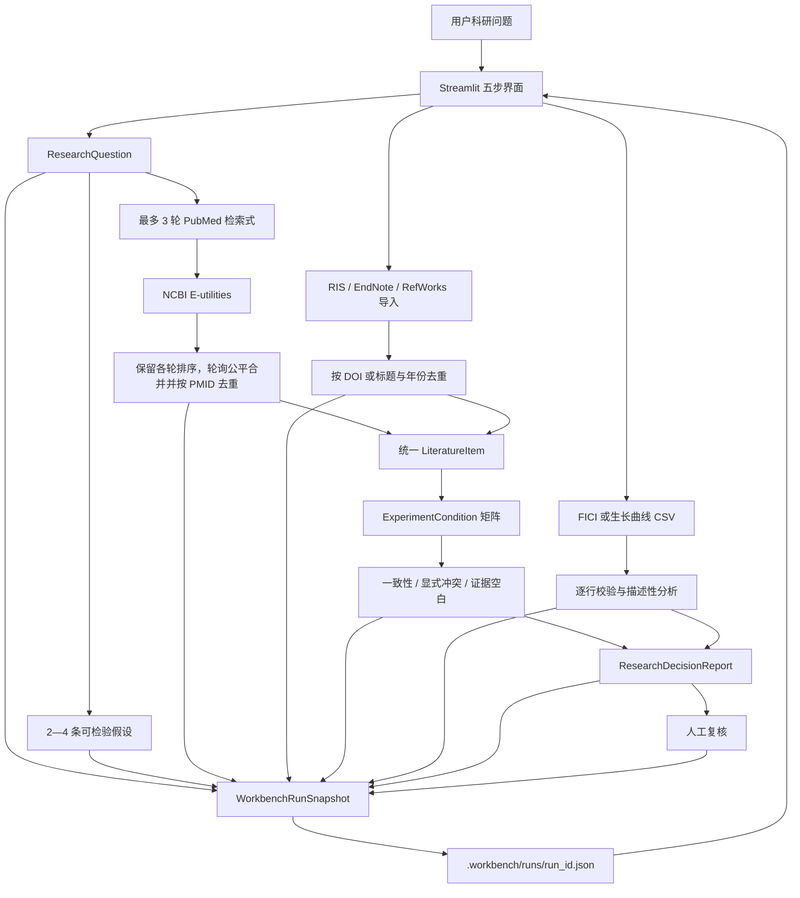
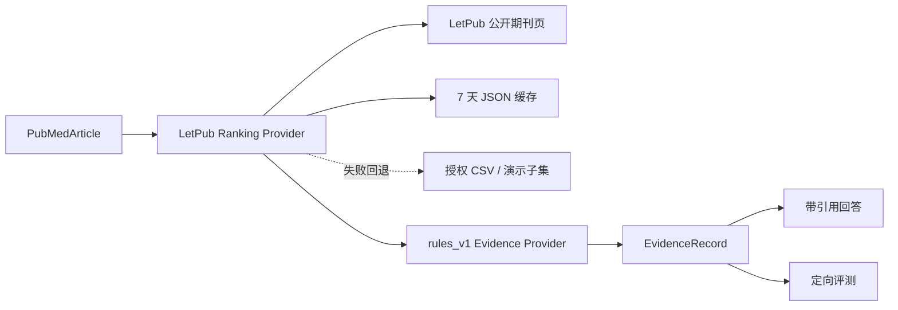

# VetResearch Workbench v0.2 架构说明

## 版本关系

VetResearch Workbench v0.2 复用 VetEvidence AI v0.1 的 PubMed、期刊分区、规则提取、引用和评测能力，在其上新增问题拆解、多来源导入、实验条件比较、CSV 分析、决策报告与本地审计恢复。

包名继续使用 `vetevidence`，以避免为产品升级进行无收益的代码重命名。

## 主数据流



## v0.1 继承子流程



v0.2 的多轮检索保留每个查询内部的 PubMed 相关性顺序，以轮询方式让每个非空查询每轮最多贡献一个新 PMID；跨查询重复不会消耗该查询的贡献机会，查询耗尽后由其他查询回填。合并结果继续调用上述分区和规则提取能力，没有另建第二套检索系统。

## 模块职责

| 模块 | 版本 | 职责 |
|---|---|---|
| `pubmed.py` | v0.1 | ESearch/EFetch 请求、重试、XML 解析 |
| `journal_rankings.py` | v0.1 | 按 ISSN 查询 LetPub、缓存与本地回退 |
| `models.py` | v0.1 | PubMed 文献、证据、回答和旧工作流结果 |
| `extraction.py` | v0.1 | PubMed 摘要的透明规则提取 |
| `providers.py` | v0.1 | 可替换的提取与回答 Provider 边界 |
| `answering.py` | v0.1 | 逐条引用回答和局限提示 |
| `retrieval.py` | v0.1 | 单轮检索、提取与回答 |
| `evaluation.py` | v0.1 | 定向评测、分类指标和报告 |
| `literature_import.py` | v0.2 | RIS、EndNote、RefWorks 识别、规范化和去重 |
| `imported_extraction.py` | v0.2 | 从用户导入题录中透明提取可见实验字段 |
| `workbench.py` | v0.2 | 问题、假设、引用、冲突、空白、任务与复核模型 |
| `workbench_pipeline.py` | v0.2 | 多查询公平合并与去重、统一文献、条件矩阵、评估与决策报告 |
| `experiment_analysis.py` | v0.2 | FICI 与生长曲线 CSV 校验和描述性计算 |
| `run_store.py` | v0.2 | 每个运行一个 JSON 快照的原子保存、版本迁移与按 ID 恢复 |
| `app.py` | v0.2 | 五步 Streamlit UI 与会话状态 |

## 关键数据契约

### 多来源文献

`LiteratureItem` 使用 `source_id` 和 `source_type` 区分 PubMed 与用户导入来源。PMID 是可选字段：PubMed 文献保留真实 PMID，用户导入记录没有 PMID 时保持为空。

`ExperimentCondition` 固定比较物种、模型、样本量、干预、剂量、途径、时间、对照、指标、机制和关键结果，同时保留来源 ID、PMID、DOI、来源 URL 和来源片段。

### 可追溯结论

文献型 `EvidenceReference` 至少包含 PMID、DOI、来源 URL 或来源片段中的一项，任意 `source_id` 不能单独作为证据。`TraceableConclusion` 必须含至少一个合法 `EvidenceReference`；没有可追溯来源时，决策报告拒绝生成。

CSV 型 `EvidenceReference` 强制记录文件名、64 位输入 SHA-256、与哈希一致的来源 ID、原始行号和完整计算过程。FICI 保留比值与分类；生长曲线保留时间点均值、重复数和梯形 AUC。

### 审计快照

`WorkbenchRunSnapshot` 聚合：

- 科研问题、检索计划和可修改假设；
- PubMed 结果与导入文献；
- 实验条件、冲突、空白和 CSV 分析；
- 任务事件、工具调用、失败和重试关系；
- 决策报告与人工复核。

`RunStore` 将每个快照写入 `.workbench/runs/<run_id>.json`，先写临时文件再原子替换。快照使用 `schema_version=2`；旧快照会补建检索计划和迁移事件，无法证明输入哈希的旧分析与派生报告会保守失效。运行 ID 只允许安全字符，避免路径穿越；`.workbench/` 已被 Git 忽略。页面不枚举本地运行，只能凭完整运行 ID 恢复。

每次报告刷新生成新的报告 ID 和稳定的科研内容 SHA-256。人工复核事件保存该哈希和当时的完整报告快照，后续刷新不会抹掉已复核版本的审计依据。

## 分析规则

### FICI

必需列：

```text
drug_a_mic_alone
drug_a_mic_combo
drug_b_mic_alone
drug_b_mic_combo
```

系统逐行验证有限且大于零的数值，计算两个 FIC 之和，并按透明阈值分类：

- `FICI ≤ 0.5`：协同；
- `0.5 < FICI ≤ 1`：相加；
- `1 < FICI ≤ 4`：无关；
- `FICI > 4`：拮抗。

坏行保留原始字段、CSV 行号和错误，不会静默丢弃。

### 生长曲线

必需列为 `time`、`group`、`value`。系统按组和时间点计算重复值均值、标准差、样本数和来源行，再对均值曲线使用梯形法计算分组 AUC。

这两类分析都只提供描述性结果，不自动执行显著性推断、模型比较或因果判断。

## 关键取舍

### 顺序工作流而非多 Agent 框架

当前所谓 Agent 能力体现在可见检索计划、显式工具调用、任务状态、失败、重试和人工复核，而不是并发角色数量。单进程顺序编排更容易验证来源和恢复运行。

### 单体 Streamlit 而非 FastAPI

当前只有一个本地客户端，Streamlit 会话状态与本地 JSON 快照已满足五步闭环。增加独立 API 服务会扩大部署和跨进程状态范围，但不会提高当前证据质量。

### 不使用向量数据库

首个场景只处理少量题录、摘要和结构化 CSV，没有跨项目语义知识库需求。向量数据库不是完成当前闭环的必要条件。

### 规则优先

问题拆解、字段提取、冲突检测、FICI 和生长曲线均使用可见规则。规则覆盖有限，但能明确验证“来源是什么、为何得到该字段、失败发生在哪里”。

## 可靠性

- NCBI `429/5xx` 与网络错误最多重试两次；
- 多轮检索最多 3 个查询，保留各查询内部顺序，轮询公平合并并按 PMID 去重后限制全局数量；
- LetPub 失败时依次使用过期缓存和本地 CSV，不阻断 PubMed 主流程；
- 导入记录按 DOI 优先、标题与年份兜底去重；
- CSV 校验保留每一行的原始值和错误；
- 没有证据时拒绝生成结论；
- 任务状态从追加式事件序列推导，失败信息不会因后续成功而消失；
- 运行快照可序列化、原子保存并恢复；
- 合成演示数据在输入和报告中明确标记；
- 全量自动化回归当前为 `72 passed`。

真实验收执行 3 轮 NCBI 检索，三轮分别返回 7、8、0 条；轮询公平合并并去重后保留 8 个唯一结果，前两轮各贡献 4 条。外部 PubMed 数据会更新，该数量只代表当前验收。

## 安全边界

- 只自动读取公开 PubMed 元数据和摘要；
- RIS、EndNote、RefWorks 与实验 CSV 由用户主动上传并在本机处理；
- 不自动抓取知网，不读取未授权全文，不支持扫描 PDF/OCR；
- `.env`、API Key、用户数据和 `.workbench` 运行记录不进入仓库；
- 页面和报告持续显示非诊断声明；
- 用户导入来源不伪造 PMID，未报告字段不补造；
- 合成演示数据不能成为科研事实；
- 当前恢复机制把不可猜测的完整运行 ID 作为本机访问凭证，仅适用于可信单用户环境；共享部署必须增加账号与对象级授权；
- 报告必须经过人工复核，且不能替代全文、原始数据和验证性实验。
