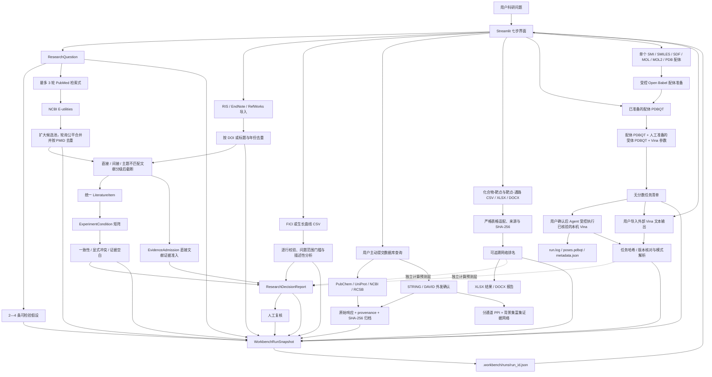
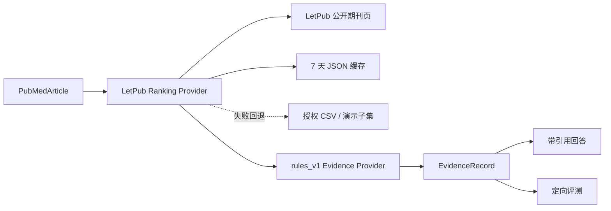

# VetResearch Workbench v0.4 架构说明

## 版本关系

VetResearch Workbench v0.4 复用 VetEvidence AI v0.1 的 PubMed、期刊分区、
规则提取、引用和评测能力，在 v0.2 的问题、实验和审计闭环上增加严格的
证据结果判定、问题范围绑定、网络药理学、Open Babel 配体准备和 AutoDock
Vina 预测层，并增加带原始响应归档的公开数据库证据层。

包名继续使用 `vetevidence`，以避免为产品升级进行无收益的代码重命名。

## 主数据流



## v0.1 继承子流程



v0.2 的多轮检索保留每个查询内部的 PubMed 相关性顺序，以轮询方式让每个非空查询每轮最多贡献一个新 PMID；跨查询重复不会消耗该查询的贡献机会，查询耗尽后由其他查询回填。合并结果继续调用上述分区和规则提取能力，没有另建第二套检索系统。

## 模块职责

| 模块 | 版本 | 职责 |
|---|---|---|
| `pubmed.py` | v0.1 | ESearch/EFetch 请求、重试、XML 解析 |
| `journal_rankings.py` | v0.1 | 按 ISSN 查询 LetPub、缓存与本地回退 |
| `models.py` | v0.1 | PubMed 文献、证据、回答和旧工作流结果 |
| `extraction.py` | v0.1 | PubMed 摘要的透明规则提取 |
| `providers.py` | v0.1 | 可替换的提取与回答 Provider 边界 |
| `answering.py` | v0.1 | 逐条引用回答和局限提示 |
| `retrieval.py` | v0.1 | 单轮检索、提取与回答 |
| `evaluation.py` | v0.1 | 定向评测、分类指标和报告 |
| `literature_import.py` | v0.2 | RIS、EndNote、RefWorks 识别、规范化和去重 |
| `imported_extraction.py` | v0.2 | 从用户导入题录中透明提取可见实验字段 |
| `workbench.py` | v0.3 | 问题、假设、结构化交互结局、引用、冲突、空白、任务与复核模型 |
| `workbench_pipeline.py` | v0.3 | 多查询融合、证据准入、实验范围门槛、评估与分层决策报告 |
| `experiment_analysis.py` | v0.3 | 带药物和病原体身份的 FICI 与生长曲线校验和描述性计算 |
| `database_connectors.py` | v0.4 | 六类公开数据库的限流、重试、标识映射、版本与原始响应来源记录 |
| `connector_artifacts.py` | v0.4 | 每个查询的不可覆盖原始响应、规范化结果、清单和 SHA-256 归档 |
| `evidence_network.py` | v0.4 | STRING 分通道证据边、仅排序综合分数及 DAVID/BH 富集证据 |
| `mechanism_prediction.py` | v0.3 | 可追溯网络关系分析、Vina 任务清单、绑定输出解析和问题范围门槛 |
| `network_files.py` | v0.3 | CSV/XLSX/DOCX 网络表格适配、模板生成及 XLSX/DOCX 结果导出 |
| `openbabel_execution.py` | v0.3 | Open Babel 发现与身份核验、单配体受控准备、可解析非退化坐标与 PDBQT 校验、执行审计 |
| `vina_execution.py` | v0.3 | 本机 Vina 发现、身份核验、受控参数执行、日志绑定和输出校验 |
| `vina_artifacts.py` | v0.3 | 任务级 `run.log`、`poses.pdbqt`、`metadata.json` 原子保存与哈希复核 |
| `run_store.py` | v0.3 | 每个运行一个 JSON 快照的原子保存、schema v6 迁移与按 ID 恢复 |
| `app.py` | v0.4 | 七步 Streamlit UI、数据库查询表单与会话状态 |

## 关键数据契约

### 多来源文献

`LiteratureItem` 使用 `source_id` 和 `source_type` 区分 PubMed 与用户导入来源。PMID 是可选字段：PubMed 文献保留真实 PMID，用户导入记录没有 PMID 时保持为空。

`ExperimentCondition` 固定比较物种、模型、样本量、干预、剂量、途径、时间、对照、指标、机制和关键结果，同时保留题名、摘要、来源 ID、PMID、DOI、来源 URL、来源片段和 `EvidenceQualification`。

`interaction-evidence-v2` 采用保守准入：结果句必须包含研究对象、两种干预、
交互指标和结构化交互结局；或者仅允许前一句完整绑定三个实体、后一句以
“该组合/the combination”明确回指并报告结果。目的、假设、评价计划、方法、
公式和阈值定义句不会准入。中文实体使用无空格匹配规则。直接文献同时保存
`synergy`、`antagonism`、`additive` 或 `indifferent` 等结构化结局，同一问题
出现协同和拮抗时生成可追溯冲突。

每轮查询获取 `max(20, 页面保留数 × 3)` 条候选记录（上限 100）。
候选先按各查询原始排序轮询去重，再按直接、间接、主题不匹配稳定分桶，
最后才截断到页面保留数。

### 可追溯结论

文献型 `EvidenceReference` 至少包含 PMID、DOI、来源 URL 或来源片段中的一项，任意 `source_id` 不能单独作为证据。`TraceableConclusion` 必须含至少一个合法 `EvidenceReference`；没有可追溯来源时，决策报告拒绝生成。

CSV 型 `EvidenceReference` 强制记录文件名、64 位输入 SHA-256、与哈希一致
的来源 ID、原始行号和完整计算过程。FICI 与生长曲线的每个有效行都必须让
两种干预和 `population_or_strain` 匹配当前问题；错配数据只能形成证据空白，
不能进入结论。

计算预测不使用 `EvidenceReference` 冒充正式证据。网络关系适配器接受 CSV、
XLSX 和 DOCX 的固定表格契约：XLSX 只能包含一个非空工作表，DOCX 只能包含
一个非空表格；格式适配后统一进入同一网络分析函数。XLSX/DOCX 导出由已验证
的 `NetworkPharmacologyResult` 生成，保留来源和哈希，但不改变证据等级。

`MechanismPredictionBundle` 独立保存网络关系输入的 accession、版本、行号和
SHA-256，以及 Vina 配体、受体、搜索框、随机种子、引擎版本、原始输出哈希和
解析模式。本机执行成功时，`VinaExecutionAudit` 还保存可执行文件 SHA-256、
实际版本、受控参数、退出码、耗时和输出 PDBQT SHA-256；绑定日志、构象文件
和元数据另存于 `.workbench/vina/<run_id>/<task_id>/`。报告单列该层，其内容
不会成为协同结论或建议的证据引用。

配体由 Open Babel 准备时，`OpenBabelLocalExecutionMetadata` 记录输入格式及
SHA-256、输出 PDBQT SHA-256、Open Babel 版本与可执行文件 SHA-256、数据目录、
3D/pH/Gasteiger 选项、规范化参数数组、退出码、耗时和有界日志。成功产物以
配体 PDBQT 的哈希进入原有 Vina 清单；失败路径不返回可用 PDBQT。受体不进入
该转换链。

### 审计快照

`WorkbenchRunSnapshot` 聚合：

- 科研问题、检索计划和可修改假设；
- PubMed 结果与导入文献；
- 实验条件、冲突、空白和 CSV 分析；
- 网络药理学结果、Vina 待运行清单、已解析对接输出及本机执行审计；
- 数据库查询标识、状态、连接器归档位置、原始响应哈希和证据网络摘要；
- 任务事件、工具调用、失败和重试关系；
- 决策报告与人工复核。

`RunStore` 将每个快照写入 `.workbench/runs/<run_id>.json`，先写临时文件再
原子替换。快照使用 `schema_version=6`；旧快照会补建检索计划和迁移事件，
旧版证据分级、无法证明输入哈希的旧分析及派生报告会保守失效，v4 快照会
获得空的机制预测层而不会伪造结果。

每次报告刷新生成新的报告 ID 和稳定的科研内容 SHA-256。人工复核事件保存该哈希和当时的完整报告快照，后续刷新不会抹掉已复核版本的审计依据。

## 分析规则

### FICI

必需列：

```text
drug_a_mic_alone
drug_a_mic_combo
drug_b_mic_alone
drug_b_mic_combo
drug_a
drug_b
population_or_strain
```

系统逐行验证有限且大于零的数值，计算两个 FIC 之和，并按透明阈值分类：

- `FICI ≤ 0.5`：协同；
- `0.5 < FICI ≤ 1`：相加；
- `1 < FICI ≤ 4`：无相互作用（indifferent）；
- `FICI > 4`：拮抗。

坏行保留原始字段、CSV 行号和错误，不会静默丢弃。

### 生长曲线

必需列为 `population_or_strain`、`intervention`、`comparator`、`time`、
`group`、`value`。每组至少两个不同时间点；系统校验输入及均值、标准差、
AUC 均为有限数值后，才对均值曲线使用梯形法计算分组 AUC。

### 网络药理学与分子对接

网络药理学只对用户提供的化合物—靶点与靶点—通路关系做交集和透明拓扑
排名，不调用黑盒靶点预测。CSV、XLSX 和 DOCX 先经过大小、结构、固定顺序
表头、重复/额外列与行数限制，再归一化为相同记录；相同
`target_accession` 只有在 organism 也一致时才能连接。分析结果可导出为
XLSX 和 DOCX。

配体入口分为两条：直接上传已准备的 PDBQT，或把单个、最大 10 MB 的
SMI/SMILES、SDF、MOL、MOL2、PDB 交给本机 Open Babel 3.2.1。执行层按显式
路径、`OPENBABEL_EXECUTABLE`、项目 `.venv` 和 `PATH` 的顺序发现工具，核验
版本、可执行文件 SHA-256 和化学参数目录，再以固定参数数组、隔离临时目录、
`shell=False` 和超时限制运行。仅允许开关 3D 生成、可选 pH 质子化；电荷模型
固定为 Gasteiger。多分子、非零退出、超时、工具错误、无效 PDBQT、全零或
完全重合坐标均失败且不产生可用配体。受体必须继续上传经人工核查的 PDBQT。

Vina 清单本身不含分数。用户可选择导入外部输出，解析器要求其中的 AutoDock
Vina 版本与清单一致，并检测标准 `mode/affinity` 表头和数值模式行；该路径
不能认证外部程序确实被运行。若用户选择 Agent 本机执行，执行层会发现并核验
显式路径、`VINA_EXECUTABLE`、本机标准安装目录或 `PATH` 中的 Vina，复核
实际版本和可执行文件 SHA-256，使用清单派生的固定参数列表、隔离临时目录、
`shell=False` 与超时限制运行。只有退出码为 0、绑定日志可解析且输出 PDBQT
有效时才形成对接结果；失败只形成任务失败记录，不保留分数。两类结果都必须
与当前问题的两种干预和研究对象匹配。UI 缓存本机 Vina 探测结果，避免每次
Streamlit 重跑都启动版本检查；已有本机执行审计的任务不能被未认证的外部
日志覆盖。

这两类分析都只提供描述性结果，不自动执行显著性推断、模型比较或因果判断。

### 公开数据库证据

六类连接器共用有界重试、限流、请求规范化和敏感字段脱敏。每次 HTTP 响应
连同来源 URL、访问时间、数据库版本或发布日期、稳定标识和 SHA-256 写入
`.workbench/connectors/<run_id>/<query_id>/`；归档使用临时目录后原子落盘，
已有查询目录不能覆盖，下载 ZIP 前再次核验每个文件。

NCBI Gene/GenBank 在缺少联系邮箱时不发送请求；STRING 与 DAVID 只有在用户
明确同意标识外发时才联网。离线路径输出带参数与哈希的请求清单。STRING 的
实验、人工整理、文本挖掘和预测通道各自形成证据边，`combined_score` 单独
保存为 `ranking_only`。富集记录必须保留 TaxID、目标集与背景集规模、原始
P 值和上游报告的 BH 校正后 P 值；上游缺失时标记为未报告，不在经过阈值
筛选的不完整检验家族上补算。STRING 与富集层只在 TaxID 和输入标识完全
一致时连接，不猜跨库身份。数据库零结果、物种覆盖不足或映射歧义均作为
限制显示，不推断为生物学阴性。

## 关键取舍

### 顺序工作流而非多 Agent 框架

当前所谓 Agent 能力体现在可见检索计划、显式工具调用、受控本机 Vina 执行、
任务状态、失败、重试和人工复核，而不是并发角色数量。单进程顺序编排更容易
验证来源和恢复运行。

### 单体 Streamlit 而非 FastAPI

当前只有一个本地客户端，Streamlit 会话状态与本地 JSON 快照已满足六步闭环。增加独立 API 服务会扩大部署和跨进程状态范围，但不会提高当前证据质量。

### 不使用向量数据库

首个场景只处理少量题录、摘要和结构化 CSV，没有跨项目语义知识库需求。向量数据库不是完成当前闭环的必要条件。

### 规则优先

问题拆解、字段提取、冲突检测、FICI 和生长曲线均使用可见规则。规则覆盖有限，但能明确验证“来源是什么、为何得到该字段、失败发生在哪里”。

## 可靠性

- NCBI `429/5xx` 与网络错误最多重试两次；
- 多轮检索最多 3 个查询，扩大候选池后保留各查询内部顺序，轮询公平合并并按 PMID 去重，再按证据等级稳定分桶和限制全局数量；
- 间接或主题不匹配文献可展示和审计，但不能进入协同文献结论；直接文献证据为 0 时报告固定声明文献证据不足；
- LetPub 失败时依次使用过期缓存和本地 CSV，不阻断 PubMed 主流程；
- 导入记录按 DOI 优先、标题与年份兜底去重；
- CSV 校验保留每一行的原始值和错误；
- 网络 CSV/XLSX/DOCX 使用同一严格列契约并限制文件大小、表格结构、行列数和 OOXML 解压规模；
- 数据库请求由表单提交触发，限制单次标识数量；外部响应按查询隔离且下载前
  复核清单与 SHA-256，认证信息不会进入规范化请求、日志或归档；
- Open Babel 只接受允许列表中的单个配体格式和最大 10 MB 输入，工具身份、数据目录、输入/输出哈希及参数均留痕；执行失败、超时、多分子、不可解析或退化坐标都不返回可用 PDBQT；
- 本机 Vina 在执行前后复核可执行文件哈希与版本，非零退出、超时、日志或输出 PDBQT 异常都不会形成分数；
- 成功的本机 Vina 任务以任务清单哈希绑定并原子保存日志、输出 PDBQT 和元数据，读取时再次校验哈希；
- 本机 Vina 探测结果在 UI 中短期缓存；已含本机执行审计的任务拒绝被用户导入日志覆盖，产物临时不可读时只降级下载区而不击穿页面；
- 没有证据时拒绝生成结论；
- 任务状态从追加式事件序列推导，失败信息不会因后续成功而消失；
- 运行快照可序列化、原子保存并恢复；
- 合成演示数据在输入和报告中明确标记；
- schema v6 会重建旧快照的文献条件；v5 及更早快照的旧报告与人工复核也会安全失效，避免机制预测新增字段后内容哈希与复核快照静默不一致；

真实负例保留 8 篇文献但无直接文献证据，状态为 `blocked_no_direct_evidence`；真实正例保留 8 篇文献，本次复跑中严格规则只准入 PMID `31749775`。外部 PubMed 数据会更新，数量和排序只代表当前验收。

## 安全边界

- 只自动读取公开 PubMed 元数据和摘要；
- 只在用户主动提交、满足 NCBI 联系信息或 STRING/DAVID 外发确认后访问相应
  公开接口；不把未公开基因列表默认发送给第三方；
- RIS、EndNote、RefWorks 与实验 CSV 由用户主动上传并在本机处理；
- 不自动抓取知网，不读取未授权全文，不支持扫描 PDF/OCR；
- `.env`、API Key、用户数据和 `.workbench` 运行记录不进入仓库；
- 不自动下载 Vina，也不执行未核验或未经用户选择的二进制程序；默认 Docker 镜像不包含 Vina，容器内执行须另行安装或挂载并通过 `VINA_EXECUTABLE` 或 `PATH` 提供；
- Open Babel 3.2.1 是 `GPL-2.0-only` 的可选本机依赖；仓库不捆绑 wheel 或二进制，二次分发须单独完成许可证合规；
- Open Babel 只做配体格式与基础结构准备，不自动准备受体；结构准备和对接都属于计算预测，不能证明结合、抗菌活性或药物协同；
- 页面和报告持续显示非诊断声明；
- 用户导入来源不伪造 PMID，未报告字段不补造；
- 合成演示数据不能成为科研事实；
- 当前恢复机制把不可猜测的完整运行 ID 作为本机访问凭证，仅适用于可信单用户环境；共享部署必须增加账号与对象级授权；
- 报告必须经过人工复核，且不能替代全文、原始数据和验证性实验。
