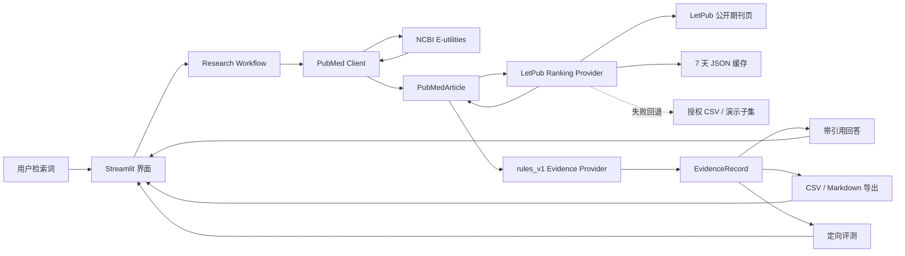

# VetEvidence AI 架构说明

## 数据流

## 模块职责

| 模块 | 职责 |
|---|---|
| `pubmed.py` | ESearch/EFetch 请求、重试、XML 解析 |
| `journal_rankings.py` | 按 ISSN 动态解析 LetPub、缓存结果并在失败时本地回退 |
| `models.py` | 文献、证据、回答、工作流结果模型 |
| `extraction.py` | 透明规则字段提取 |
| `providers.py` | 可替换 Provider 边界 |
| `answering.py` | 逐条引用回答和局限提示 |
| `retrieval.py` | 串联检索、提取和回答 |
| `export.py` | Markdown/CSV 输出 |
| `evaluation.py` | 评测执行、分类指标和报告 |
| `app.py` | Streamlit 用户界面与会话状态 |

## 关键取舍

### 为什么先用规则 Provider

- 没有 LLM Key 也能运行；
- 每个字段的来源和规则可解释；
- 便于验证“未报告即为空”；
- 暴露了表达覆盖不足的真实局限。

`EvidenceProvider` 已隔离提取和回答接口，后续可增加 LLM 实现，但必须继续满足结构化校验和引用约束。

### 为什么采用 LetPub + 缓存 + 本地回退

- 用户需要检索结果中的每篇文献都能自动补充分区，静态演示表覆盖不足；
- ISSN 比期刊名稳定，动态查询优先使用 ISSN，名称只作兜底；
- 中科院固定读取 2025 年 3 月升级版，WOS 固定读取 JIF 表，避免混用不同口径；
- 7 天缓存减少重复访问，并在 LetPub 短时故障时保持可用；
- CSV 保留离线回退和机构授权替换能力；
- 一个期刊可属于多个分类，系统保留每个分类的分区和名次，不强行合并；
- LetPub 不是官方 API，页面结构变化是已知风险，界面明确显示来源与复核提示。

### 为什么暂不使用 FastAPI

当前只有一个本地 Streamlit 客户端。增加独立 API 服务会扩大部署、跨进程状态和错误处理范围，却不会改善第一版证据质量，因此 48 小时版本保持单进程。

### 为什么暂不使用向量数据库

第一版直接处理少量 PubMed 检索结果，没有长文档集合和跨会话知识库需求。向量数据库会增加基础设施，当前收益不足。

## 可靠性

- NCBI `429/5xx` 和网络错误最多重试两次；
- LetPub 请求最多重试一次，同批重复期刊去重并限制最多 4 路并发；
- LetPub 查询失败依次使用过期缓存和本地 CSV，不阻断 PubMed 主流程；
- 记录每次研究工作流的请求次数；
- 没有证据时明确拒绝回答；
- 关键结论保留 PMID、DOI 和来源原句；
- 分区记录保留版本、分类、来源 URL 和复核备注；
- 未匹配期刊同时显示两套“未收录”，不推断分区；
- 评测失败保留 `expectation_mismatch` 或 `evaluation_error` 分类。

## 安全边界

- 只使用公开 PubMed 元数据和摘要；
- API Key 通过环境变量传入；
- `.env`、密钥和私有数据不进入仓库；
- 页面持续显示非诊断声明；
- 动物或体外结果不直接外推临床。
