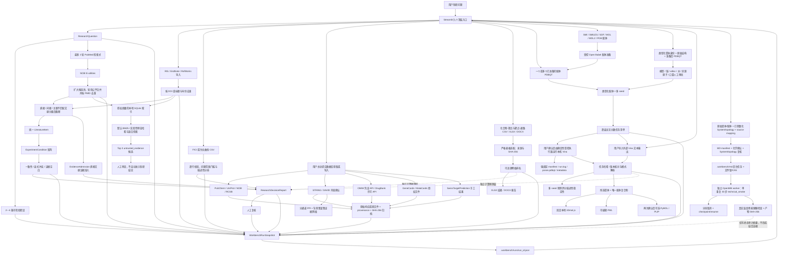
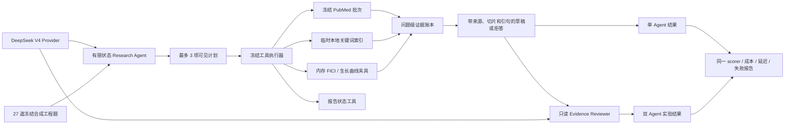
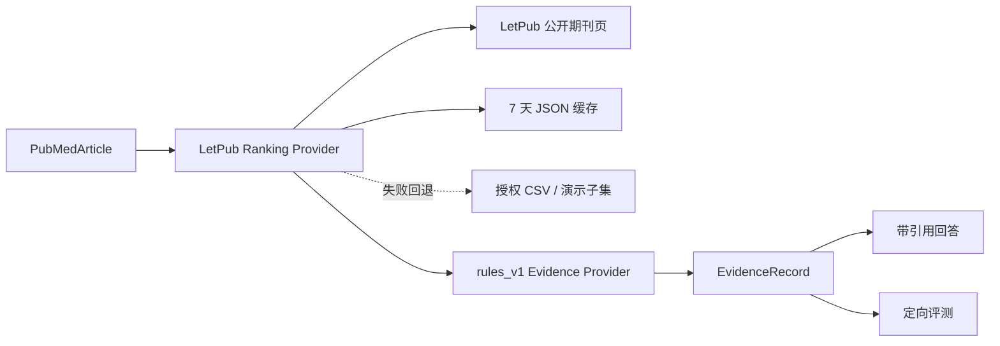

# VetResearch Workbench v0.7.0 架构说明

## 版本关系

VetResearch Workbench v0.6 复用 VetEvidence AI v0.1 的 PubMed、期刊分区、
规则提取、引用和评测能力，在 v0.2 的问题、实验和审计闭环上增加严格的
证据结果判定、问题范围绑定、网络药理学、Open Babel 配体准备和 AutoDock
Vina 预测层和带原始材料归档的数据库证据层；v0.5 再增加受体人工门禁、
类型化结构身份、批量多 seed 对接、强绑定产物和本地三维可视化层。v0.6
增加与主界面解耦的 OpenMM 后台任务层，但严格限制为单重复 30 步
`technical_smoke`。v0.7.0 再增加不需要模型 Key 的本地关键词检索，以及与
Streamlit 免费路径隔离的 DeepSeek Research Agent／Evidence Reviewer 工程
评测链；后者只运行版本化合成题和冻结工具夹具。

包名继续使用 `vetevidence`，以避免为产品升级进行无收益的代码重命名。

## 主数据流



## v0.7.0 隔离 Agent 评测数据流



真实 DeepSeek 调用、Prompt、Token、费用和失败审计都在这条评测链内发生；工具
数据仍是合成冻结夹具。当前没有从 Streamlit、任意用户问题或实时 PubMed 进入
该链的产品适配器，也没有 MCP／Codex Skill 接口。

## v0.1 继承子流程



v0.2 的多轮检索保留每个查询内部的 PubMed 相关性顺序，以轮询方式让每个非空查询每轮最多贡献一个新 PMID；跨查询重复不会消耗该查询的贡献机会，查询耗尽后由其他查询回填。合并结果继续调用上述分区和规则提取能力，没有另建第二套检索系统。

## 模块职责

| 模块 | 版本 | 职责 |
|---|---|---|
| `pubmed.py` | v0.1 | ESearch/EFetch 请求、重试、XML 解析 |
| `journal_rankings.py` | v0.1 | 按 ISSN 查询 LetPub、缓存与本地回退 |
| `models.py` | v0.1 | PubMed 文献、证据、回答和旧工作流结果 |
| `extraction.py` | v0.1 | PubMed 摘要的透明规则提取 |
| `providers.py` | v0.1 | 可替换的提取与回答 Provider 边界 |
| `answering.py` | v0.1 | 逐条引用回答和局限提示 |
| `retrieval.py` | v0.1 | 单轮检索、提取与回答 |
| `evaluation.py` | v0.1 | 定向评测、分类指标和报告 |
| `literature_import.py` | v0.2 | RIS、EndNote、RefWorks 识别、规范化和去重 |
| `imported_extraction.py` | v0.2 | 从用户导入题录中透明提取可见实验字段 |
| `workbench.py` | v0.3 | 问题、假设、结构化交互结局、引用、冲突、空白、任务与复核模型 |
| `workbench_pipeline.py` | v0.3 | 多查询融合、证据准入、实验范围门槛、评估与分层决策报告 |
| `experiment_analysis.py` | v0.3 | 带药物和病原体身份的 FICI 与生长曲线校验和描述性计算 |
| `database_connectors.py` | v0.4+ | 通用连接器模型、限流、重试、标识映射、获取方式与来源记录 |
| `licensed_connectors.py` | 增量 | OMIM 凭证 API 与 DrugBank 许可 API、双门禁、详情补全和截断警告 |
| `restricted_database_imports.py` | 增量 | GeneCards、MalaCards、SwissTargetPrediction 的本地 CSV/TSV/XLSX 安全导入 |
| `database_ui_support.py` | 增量 | 12 个数据源配置、获取方式、证据等级、物种与许可门禁 |
| `connector_artifacts.py` | v0.4 | 每个查询的不可覆盖原始响应、规范化结果、清单和 SHA-256 归档 |
| `evidence_network.py` | v0.4 | STRING 分通道证据边、仅排序综合分数及 DAVID/BH 富集证据 |
| `mechanism_prediction.py` | v0.3 | 可追溯网络关系分析、Vina 任务清单、绑定输出解析和问题范围门槛 |
| `network_files.py` | v0.3 | CSV/XLSX/DOCX 网络表格适配、模板生成及 XLSX/DOCX 结果导出 |
| `openbabel_execution.py` | v0.3 | Open Babel 发现与身份核验、单配体受控准备、可解析非退化坐标与 PDBQT 校验、执行审计 |
| `vina_execution.py` | v0.3 | 本机 Vina 发现、身份核验、受控参数执行、日志绑定和输出校验 |
| `vina_artifacts.py` | v0.3 | 任务级 `run.log`、`poses.pdbqt`、`metadata.json` 原子保存与哈希复核 |
| `docking_workflow.py` | v0.5 | 类型化结构身份、受体人工审批、批量配体/多 seed 任务与强绑定结果汇总 |
| `docking_visualization.py` | v0.5 | 从已验证对接尝试生成复合物、可编辑 PML、可选 PyMOL/PLIP 产物与状态校验 |
| `structure_viewer.py` | v0.5 | 从固定本地 ES module 加载 3Dmol.js，并用链与残基唯一选择器展示复合物 |
| `md_workflow.py` | v0.6 | MD 来源、化学门禁、协议、manifest、分析保留字段与执行审计模型 |
| `md_worker.py` | v0.6 | OpenMM 预检、参数化输入复核、后台任务状态、取消/checkpoint/resume、30 步执行和产物校验 |
| `md_ui_support.py` | v0.6 | MD 表单输入规范化、原子映射证据、任务进度和下载前哈希复核 |
| `md_ui.py` | v0.6 | 只提交/轮询独立 worker 的 Streamlit MD 入口，不在页面请求内执行 OpenMM |
| `run_store.py` | v0.3 | 每个运行一个 JSON 快照的原子保存、schema v6 迁移与按 ID 恢复 |
| `agent_providers.py` | v0.7.0 | LLM／Embedding Provider 契约、Fake Provider 与确定性特征哈希向量 |
| `local_rag.py` | v0.7.0 | SQLite 来源／切片／向量清单、BM25、余弦检索、过滤与完整性校验 |
| `workbench_rag.py`、`local_rag_ui.py` | v0.7.0 | 免费工作台授权摘要索引、默认关键词 Top 3 与实验模式入口 |
| `deepseek_provider.py` | v0.7.0 | DeepSeek V4 请求、模型身份、Token／费用、超时和共享预算审计 |
| `agent_tools.py` | v0.7.0 | 五类严格工具 schema、证据等级和冻结回放执行边界 |
| `agent_runtime.py` | v0.7.0 | 有限状态 Research Agent、证据账本、引用／拒答门禁与有界恢复 |
| `evidence_reviewer.py` | v0.7.0 | 只读 Reviewer、有限定向修订和安全人工复核状态 |
| `v07_*evaluation.py`、`v07_agent_comparison.py` | v0.7.0 | 规则／RAG／单 Agent／双 Agent 的版本化合成评测与报告 |
| `app.py` | v0.7.0 | 九个顶层 Streamlit 入口、免费本地检索、数据库／对接门禁、MD 任务与会话状态 |

## 关键数据契约

### 多来源文献

`LiteratureItem` 使用 `source_id` 和 `source_type` 区分 PubMed 与用户导入来源。PMID 是可选字段：PubMed 文献保留真实 PMID，用户导入记录没有 PMID 时保持为空。

`ExperimentCondition` 固定比较物种、模型、样本量、干预、剂量、途径、时间、对照、指标、机制和关键结果，同时保留题名、摘要、来源 ID、PMID、DOI、来源 URL、来源片段和 `EvidenceQualification`。

`interaction-evidence-v2` 采用保守准入：结果句必须包含研究对象、两种干预、
交互指标和结构化交互结局；或者仅允许前一句完整绑定三个实体、后一句以
“该组合/the combination”明确回指并报告结果。目的、假设、评价计划、方法、
公式和阈值定义句不会准入。中文实体使用无空格匹配规则。直接文献同时保存
`synergy`、`antagonism`、`additive` 或 `indifferent` 等结构化结局，同一问题
出现协同和拮抗时生成可追溯冲突。

每轮查询获取 `max(20, 页面保留数 × 3)` 条候选记录（上限 100）。
候选先按各查询原始排序轮询去重，再按直接、间接、主题不匹配稳定分桶，
最后才截断到页面保留数。

### 可追溯结论

文献型 `EvidenceReference` 至少包含 PMID、DOI、来源 URL 或来源片段中的一项，任意 `source_id` 不能单独作为证据。`TraceableConclusion` 必须含至少一个合法 `EvidenceReference`；没有可追溯来源时，决策报告拒绝生成。

CSV 型 `EvidenceReference` 强制记录文件名、64 位输入 SHA-256、与哈希一致
的来源 ID、原始行号和完整计算过程。FICI 与生长曲线的每个有效行都必须让
两种干预和 `population_or_strain` 匹配当前问题；错配数据只能形成证据空白，
不能进入结论。

计算预测不使用 `EvidenceReference` 冒充正式证据。网络关系适配器接受 CSV、
XLSX 和 DOCX 的固定表格契约：XLSX 只能包含一个非空工作表，DOCX 只能包含
一个非空表格；格式适配后统一进入同一网络分析函数。XLSX/DOCX 导出由已验证
的 `NetworkPharmacologyResult` 生成，保留来源和哈希，但不改变证据等级。

`MechanismPredictionBundle` 独立保存网络关系输入的 accession、版本、行号和
SHA-256，以及 Vina 配体、受体、搜索框、随机种子、引擎版本、原始输出哈希和
解析模式。本机执行成功时，`VinaExecutionAudit` 还保存可执行文件 SHA-256、
实际版本、受控参数、退出码、耗时和输出 PDBQT SHA-256；绑定日志、构象文件
和元数据另存于 `.workbench/vina/<run_id>/<task_id>/`。报告单列该层，其内容
不会成为协同结论或建议的证据引用。

配体由 Open Babel 准备时，`OpenBabelLocalExecutionMetadata` 记录输入格式及
SHA-256、输出 PDBQT SHA-256、Open Babel 版本与可执行文件 SHA-256、数据目录、
3D/pH/Gasteiger 选项、规范化参数数组、退出码、耗时和有界日志。成功产物以
配体 PDBQT 的哈希进入原有 Vina 清单；失败路径不返回可用 PDBQT。受体不进入
该转换链。

v0.5 的 `ReceptorApproval` 同时绑定原始结构和已准备 PDBQT 的 SHA-256、
类型化 `ReceptorIdentity`、选定模型/链、altloc 策略、水和每类异源原子决策、
准备工具与版本、口袋依据/来源哈希以及用户确认。准备后文件必须只包含已选择
的受体内容，并能证明来自该次原始结构；任一绑定字段改变即拒绝复用审批。

`LigandIdentity` 只接受 PubChem CID + InChIKey，或带来源哈希的显式用户
命名空间。批量层为每个“配体 × seed”生成独立、长度受限且带摘要后缀的任务
ID。`DockingAttempt` 只从已复核的 Vina 任务清单、绑定日志和输出 PDBQT
派生预测评分、模式、seed 与各文件哈希，避免把任意日志、pose 或评分拼接成
结果。跨 seed 汇总只做预测评分的均值、标准差和极差等描述性统计，不提供
当前没有计算的跨 seed RMSD 或构象簇。

可视化层只接受已验证 `DockingAttempt`，从所选受体链和明确保留的异源原子
生成复合物，并给新配体分配唯一 chain/resid。固定的
`assets/vendor/3dmol/3Dmol.es6-min.js` 以 ES module 的具名 `createViewer`
接口在 Streamlit CCv2 中加载，不请求 CDN。PML、复合物、脚本与任务哈希绑定；
PyMOL 渲染、PSE 和 PLIP 分析要求用户再次确认。PNG 需完整解码校验；PSE
只有经同一已核验 PyMOL 重开成功才标为已验证，否则为
`generated_unverified`。PDBQT→PDB 会损失部分键级、电荷和原子类型，因此
PLIP 与三维相互作用解释只能作启发式辅助。

### 分子动力学技术烟测

`MDTaskManifest` 只允许 `md-manifest-v0.6` 与 `technical_smoke`，固定单重复、
单 seed、30 个积分步，并把原始受体/配体来源、化学确认、检测到的金属/共价/
未知残基风险、温度/积分器参数、硬件请求和用户批准绑定到 manifest
SHA-256。PDBQT 不能作为受体或配体的唯一 MD 化学来源；未解决的金属、共价
连接或未知残基风险阻断真实执行。

`MDPreparedSystemReference` 绑定实际 `System XML`、topology PDB、两份原始
来源、力场/参数文件、准备工具/版本、准确参数数组和逐原子 canonical
source→topology 映射证据。受体行核对链、残基、编号、插入码、原子名、
altloc 与元素；配体行核对源原子索引与元素。System XML 拒绝
DOCTYPE/外部实体；保存前反序列化并复核实际粒子数、force/constraint 类型
与数量及 topology 原子数，不能信任用户填写摘要。v0.6 拒绝周期 System 和
带 `CRYST1` 的 topology，直到盒向量可双向绑定。

`MDJobStore` 把 job JSON、原始输入、准备输入、`attempt-XXXX`、checkpoint
和结果清单隔离到 `.workbench/md/`。状态更新在跨进程文件锁内执行 revision
compare-and-swap；每次 attempt 使用新目录且拒绝覆盖。启动恢复会把没有存活
worker PID 的遗留 `running/cancel_requested` 状态转为明确失败或取消。UI
只能启动独立 `md_worker` 并轮询文件状态，不能直接调用 OpenMM 执行函数。

worker 分块执行最小化与 30 步积分，每块检查取消请求并发布
`MDCheckpointReference`。checkpoint 同时绑定 manifest、System、topology、
replica、seed、step、OpenMM 版本，以及实际 Context 的平台、设备、精度和
基础硬件组合指纹；恢复前复核内容、路径边界与
SHA-256。实际执行审计记录平台、设备、精度、随机源、包版本、力场哈希和
执行环境指纹；驱动只在 OpenMM 后端报告该属性时记录。`gpu_required=true`
时没有 GPU 平台会失败，不静默降级。

`MDAnalysisResult.produced_metrics` 只允许真实 `temperature_kelvin` 与
`potential_energy_kj_mol`。RMSD、RMSF、回转半径、接触、氢键、压力和密度
保留在 `reserved_metrics_not_produced`，`free_energy_computed` 固定为
`false`。`technical_smoke_passed` 只代表最小数值执行和规定产物通过，不是
NVT/NPT、production、收敛、稳定结合或药效结论。

### 审计快照

`WorkbenchRunSnapshot` 聚合：

- 科研问题、检索计划和可修改假设；
- PubMed 结果与导入文献；
- 实验条件、冲突、空白和 CSV 分析；
- 网络药理学结果、Vina 待运行清单、已解析对接输出及本机执行审计；
- 数据库查询标识、状态、连接器归档位置、原始响应哈希和证据网络摘要；
- MD 任务创建、终态和错误的审计摘要；完整 MD job 与大体积产物仍留在
  `.workbench/md/`，不嵌入主快照；
- 任务事件、工具调用、失败和重试关系；
- 决策报告与人工复核。

`RunStore` 将每个快照写入 `.workbench/runs/<run_id>.json`，先写临时文件再
原子替换。快照使用 `schema_version=6`；旧快照会补建检索计划和迁移事件，
旧版证据分级、无法证明输入哈希的旧分析及派生报告会保守失效，v4 快照会
获得空的机制预测层而不会伪造结果。

每次报告刷新生成新的报告 ID 和稳定的科研内容 SHA-256。人工复核事件保存该哈希和当时的完整报告快照，后续刷新不会抹掉已复核版本的审计依据。

## 分析规则

### FICI

必需列：

```text
drug_a_mic_alone
drug_a_mic_combo
drug_b_mic_alone
drug_b_mic_combo
drug_a
drug_b
population_or_strain
```

系统逐行验证有限且大于零的数值，计算两个 FIC 之和，并按透明阈值分类：

- `FICI ≤ 0.5`：协同；
- `0.5 < FICI ≤ 1`：相加；
- `1 < FICI ≤ 4`：无相互作用（indifferent）；
- `FICI > 4`：拮抗。

坏行保留原始字段、CSV 行号和错误，不会静默丢弃。

### 生长曲线

必需列为 `population_or_strain`、`intervention`、`comparator`、`time`、
`group`、`value`。每组至少两个不同时间点；系统校验输入及均值、标准差、
AUC 均为有限数值后，才对均值曲线使用梯形法计算分组 AUC。

### 网络药理学与分子对接

网络药理学只对用户提供的化合物—靶点与靶点—通路关系做交集和透明拓扑
排名，不调用黑盒靶点预测。CSV、XLSX 和 DOCX 先经过大小、结构、固定顺序
表头、重复/额外列与行数限制，再归一化为相同记录；相同
`target_accession` 只有在 organism 也一致时才能连接。分析结果可导出为
XLSX 和 DOCX。

配体入口分为两条：直接上传已准备的 PDBQT，或把单个、最大 10 MB 的
SMI/SMILES、SDF、MOL、MOL2、PDB 交给本机 Open Babel 3.2.1。执行层按显式
路径、`OPENBABEL_EXECUTABLE`、项目 `.venv` 和 `PATH` 的顺序发现工具，核验
版本、可执行文件 SHA-256 和化学参数目录，再以固定参数数组、隔离临时目录、
`shell=False` 和超时限制运行。仅允许开关 3D 生成、可选 pH 质子化；电荷模型
固定为 Gasteiger。多分子、非零退出、超时、工具错误、无效 PDBQT、全零或
完全重合坐标均失败且不产生可用配体。受体必须继续上传经人工核查的 PDBQT。

Vina 清单本身不含分数。用户可选择导入外部输出，解析器要求其中的 AutoDock
Vina 版本与清单一致，并检测标准 `mode/affinity` 表头和数值模式行；该路径
不能认证外部程序确实被运行。若用户选择 Agent 本机执行，执行层会发现并核验
显式路径、`VINA_EXECUTABLE`、本机标准安装目录或 `PATH` 中的 Vina，复核
实际版本和可执行文件 SHA-256，使用清单派生的固定参数列表、隔离临时目录、
`shell=False` 与超时限制运行。只有退出码为 0、绑定日志可解析且输出 PDBQT
有效时才形成对接结果；失败只形成任务失败记录，不保留分数。两类结果都必须
与当前问题的两种干预和研究对象匹配。UI 缓存本机 Vina 探测结果，避免每次
Streamlit 重跑都启动版本检查；已有本机执行审计的任务不能被未认证的外部
日志覆盖。

科研级批处理在这条既有执行链之外增加审批和产物所有权门槛：受体审批哈希、
配体身份、seed、搜索框、Vina 二进制身份、日志哈希与 pose 哈希必须一致，
才能进入批量汇总或可视化。官方 `1IEP` 示例只用于验证真实 Vina 进程和产物
绑定，不进入兽医科研问题的证据层。

这两类分析都只提供描述性结果，不自动执行显著性推断、模型比较或因果判断。

### 分子动力学技术烟测

v0.6 不从对接 PDBQT 自动生成 MD 体系。真实执行只接受已裁剪为所选链、
无 altloc 的单模型受体 PDB、单记录 V2000 配体 SDF、已经参数化的
`System XML`、匹配非周期 topology、实际力场/参数文件、准备工具/命令和
逐原子 canonical 映射。预检先核对格式、来源哈希、化学风险、
System/topology 摘要、粒子/force/constraint 和资源上限；周期体系安全拒绝。

worker 只执行单重复 30 步 `technical_smoke`。分块步进用于取消与 checkpoint，
不是 NVT/NPT 分阶段协议。成功要求真实温度和势能序列存在、非空、有限且落在
宽松数值安全边界内，并要求 manifest、trajectory、state、checkpoint、
portable state、代表结构、分析 JSON 和 PML 等规定产物全部通过清单与
SHA-256 复核。没有真实序列时失败，不用占位数据填充。

当前不运行或计算科研级平衡/生产模拟、RMSD、RMSF、回转半径、配体 RMSD、
接触、氢键、压力、密度、收敛、不确定性或任何自由能方法。MD 势能也不是
结合自由能；GPU 成功运行不提高证据等级，也不保证逐位确定性。

正式 `scripts/run_md_smoke.py` 用完全公开的合成两原子 N+C fixture 经上述
同一 job/worker/工件链分别强制 CPU、CUDA 验收；两者均为 30 steps，各记录
6 个真实温度和 6 个真实势能样本并通过 QC。CUDA 审计确认
`NVIDIA GeForce RTX 5070 Laptop GPU`、`DeviceIndex=0`、`mixed`；CPU
审计确认实际平台 `CPU`。这些信息是执行链证据，不是生物分子科研结果。

### 数据库证据、许可 API 与人工导入

数据库页有 12 个入口。公开 API、凭证 API、许可 API、授权文件和人工预测
结果共用同一 `ConnectorResult`，但获取方式
`online_api/manual_import/offline_request` 与证据等级
`curated_database/computational_prediction` 分开记录。每次 HTTP 响应或
导入文件连同来源 URL、访问/导入时间、版本或导出日期（如有）、稳定标识和
SHA-256 写入 `.workbench/connectors/<run_id>/<query_id>/`；人工导入使用
`method=IMPORT`、`http_status=None`。归档经短临时目录原子落盘，已有查询
目录不能覆盖，下载 ZIP 前按 manifest 再次核验每个文件。

NCBI Gene/GenBank 在缺少联系邮箱时不发送请求；STRING 与 DAVID 只有在用户
明确同意标识外发时才联网。OMIM 缺少 Key 时不联网；DrugBank 缺少 Key 或
当次许可确认时不联网。GeneCards、MalaCards 和 SwissTargetPrediction 不做
网页抓取，只接受用户确认后的本地文件；前两者固定人类 TaxID 9606，Swiss
只接受人、小鼠和大鼠且固定为计算预测。离线路径输出带参数与哈希的请求
清单。STRING 的
实验、人工整理、文本挖掘和预测通道各自形成证据边，`combined_score` 单独
保存为 `ranking_only`。富集记录必须保留 TaxID、目标集与背景集规模、原始
P 值和上游报告的 BH 校正后 P 值；上游缺失时标记为未报告，不在经过阈值
筛选的不完整检验家族上补算。STRING 与富集层只在 TaxID 和输入标识完全
一致时连接，不猜跨库身份。数据库零结果、物种覆盖不足或映射歧义均作为
限制显示，不推断为生物学阴性。

## 关键取舍

### 免费产品主流程与隔离 LLM Agent

Streamlit 主流程继续使用透明规则、显式用户操作和人工复核；默认本地检索只
返回候选，不调用 LLM。v0.7.0 的 Research Agent 是真实 DeepSeek 驱动的有限
状态流程，但只在开发者评测中读取冻结合成数据。Evidence Reviewer 复核同一次
Research 的草稿、证据账本和工具摘要，不能重新检索或添加来源；它是第二个受限
角色，不是独立研究团队或开放式自治多 Agent 系统。

当前 v0.7.0 的修复后 27 题全量中，单／双 Agent 为 `23/27`、`24/27`。Reviewer
本批改善 Citation Precision、Unsupported Claim Rate 和 Abstention Accuracy，但 Recall 与
Task Completion 不变，三道规划／工具失败仍共享，并增加 `¥0.2480774` 与中位
`13.6231 s` 延迟。历史全量对照又曾出现无改善或反向波动，因此双 Agent 仅保留
实验模式，不是默认路径。受控
本机 Vina 的“Agent 执行”是更早版本对显式工具动作的称呼，与本节 LLM Research
Agent 不应混为一谈。

### 顺序主工作流与专用 MD worker

免费证据主流程保持顺序编排；只有 OpenMM 因运行时间、取消和 checkpoint 需求
进入专用子进程，并用文件锁、CAS 与内容寻址工件隔离。LLM Agent 评测也不调度
该 worker，更不是通用多 Agent 调度框架。

### 单体 Streamlit 而非 FastAPI

当前只有一个本地客户端，Streamlit 会话状态、主流程 JSON 快照和 MD 文件型
后台任务已满足当前九个入口。增加独立 API 服务会扩大部署和权限边界，但不会
提高当前证据质量。

### 本地 SQLite 检索，而非云向量数据库

当前仍只处理少量题录、摘要和结构化 CSV，没有跨项目、多租户或高并发知识库
需求。v0.7.0 因此使用标准库 SQLite 保存来源、切片和向量，在本机执行
BM25、精确余弦和元数据过滤；来源、切片和向量字节分别绑定 SHA-256。用户
材料不需要为了检索上传云向量数据库，也没有查询费或月租。

工作台把该路径放在现有“文献证据”页末尾，不增加新的顶层页签。输入只包含
当前任务中带摘要的 PubMed 记录，以及用户逐次确认有权用于本机索引的导入
摘要；缺摘要记录被排除。每次最多 500 个来源、500 万字符，固定切片参数和
Top 3，查询最多 2,000 字符。当前默认 `keyword_only`，只有正关键词分数才
返回候选；零分时明确返回 `insufficient_evidence`。`hash_vector_only` 与
`hybrid` 只作为实验模式。

索引放在 `.workbench/local-rag/<run_id>.sqlite3`。每次页面重跑都核对当前授权
来源集合与持久化来源及 manifest；来源变化后旧索引失效。来源、切片或向量
遭篡改时读取或检索安全失败，用户可原子重建。检索结果只作为
`untrusted_evidence` 候选表展示，不进入 Markdown／HTML 指令解释，也不直接
改变证据准入或报告结论。审计只保存查询 SHA-256、命中切片 ID、Provider 身份、
索引清单哈希和固定零费用字段，不复制原始查询或正文。

首个向量 Provider 是确定性的中英文字符／词特征哈希，只用于不新增模型、API
订阅或云向量库依赖的管线和 CI
基线，不是训练得到的语义 Embedding。固定硬负例评测中关键词、特征哈希向量、
混合的候选池内排序 Recall@3 分别为 `4/5`、`2/5`、`3/5`，因此当前不能声称
向量带来收益。这条离线路径仍依赖 Python、Pydantic、本机 CPU、磁盘和 SQLite；
当前产品不规划自带本地语义模型；如果用户自行替换 Provider，现有接口的
`network_used` 字段只是契约检查，不是进程级断网沙箱。现阶段没有引入独立
向量数据库，也不能把特征哈希或混合模式宣传为有效语义 RAG。

### 规则优先

问题拆解、字段提取、冲突检测、FICI 和生长曲线均使用可见规则。规则覆盖有限，但能明确验证“来源是什么、为何得到该字段、失败发生在哪里”。

## 可靠性

- NCBI `429/5xx` 与网络错误最多重试两次；
- 多轮检索最多 3 个查询，扩大候选池后保留各查询内部顺序，轮询公平合并并按 PMID 去重，再按证据等级稳定分桶和限制全局数量；
- 间接或主题不匹配文献可展示和审计，但不能进入协同文献结论；直接文献证据为 0 时报告固定声明文献证据不足；
- LetPub 失败时依次使用过期缓存和本地 CSV，不阻断 PubMed 主流程；
- 导入记录按 DOI 优先、标题与年份兜底去重；
- 本地检索只接受带摘要且在 `public` 或当次 `user_authorized` 范围内的来源；
  文献集合变化会使旧索引过期，零关键词分数不返回候选；损坏 SQLite 的连接在
  失败时关闭，避免 Windows 文件锁阻止原子重建；
- Research Agent 每题最多 3 个计划项、4 次工具调用、2 次正常模型调用和 1 次
  有界恢复；只有首次 drafting 明确截断时才可把输出上限从 2048 提高到 4096；
- Agent 只接受 PubMed、本地 RAG、FICI、生长曲线和报告五类结构化工具调用，
  不接受 Shell、任意本机路径、任意 URL 或可执行代码；仅有 contextual 或
  out-of-scope 证据时在生成前拒答；
- DeepSeek Provider 默认费用上限为 0；真实运行必须显式选题、确认付费并给出
  正数人民币硬上限。Provider 不做隐式 HTTP 重试，Key 不进入审计或结果；
- Reviewer 最多两次审查和一次定向修订，使用与单 Agent 相同的 Research 状态；
  初次审查明确截断时只允许一次 2048→4096 有界恢复，未批准时只公开安全拒答或
  人工复核状态；`TOOL-02` 真实全量已验证恢复成功后仍会拒绝不完整检索；
- CSV 校验保留每一行的原始值和错误；
- 网络 CSV/XLSX/DOCX 使用同一严格列契约并限制文件大小、表格结构、行列数和 OOXML 解压规模；
- 数据库请求由表单提交触发，限制单次标识数量；外部响应按查询隔离且下载前
  复核清单与 SHA-256，认证信息不会进入规范化请求、日志或归档；
- 受限数据库文件最大 10 MiB、50,000 行、256 列；XLSX 拒绝公式、宏、嵌入
  对象、外部链接、异常展开大小和压缩比，并要求安全 XML 解析器；
- Open Babel 只接受允许列表中的单个配体格式和最大 10 MB 输入，工具身份、数据目录、输入/输出哈希及参数均留痕；执行失败、超时、多分子、不可解析或退化坐标都不返回可用 PDBQT；
- 本机 Vina 在执行前后复核可执行文件哈希与版本，非零退出、超时、日志或输出 PDBQT 异常都不会形成分数；
- 成功的本机 Vina 任务以任务清单哈希绑定并原子保存日志、输出 PDBQT 和元数据，读取时再次校验哈希；
- 受体模型、链、altloc、水、异源原子、准备文件或口袋依据变化后，旧审批
  立即失效；名称相同不能绕过哈希和类型化身份复核；
- 批量任务逐尝试隔离并绑定 manifest/log/pose/seed/score；错配的任何一个
  产物都不能进入统计或可视化；
- 3Dmol.js 使用固定本地资产及上游元数据/许可证；PNG 做完整图像解码，PSE
  未经同一核验 PyMOL 重开时降级，外部 PyMOL/PLIP 无用户确认时不执行；
- MD 原始输入、参数化输入、mapping、checkpoint 和结果均限制在 job/attempt
  专属目录；System XML 拒绝外部实体，任务与工件读取时重新计算 SHA-256；
- MD job 更新使用跨进程文件锁与 revision CAS；worker 失联会被启动校正明确
  标记，取消先协作检查步块，页面持有进程句柄时可超时终止，CLI worker 另有
  300 秒硬截止；恢复必须复核 manifest/System/topology/seed/OpenMM 和实际
  Context 执行环境绑定；
- OpenMM 的粒子数、force/constraint、积分步数、运行时间和输出大小均有硬
  上限；GPU 被要求但不可用时不静默回退，实际平台/设备/精度/驱动写入审计；
- 本机 Vina 探测结果在 UI 中短期缓存；已含本机执行审计的任务拒绝被用户导入日志覆盖，产物临时不可读时只降级下载区而不击穿页面；
- 没有证据时拒绝生成结论；
- 任务状态从追加式事件序列推导，失败信息不会因后续成功而消失；
- 运行快照可序列化、原子保存并恢复；
- 合成演示数据在输入和报告中明确标记；
- schema v6 会重建旧快照的文献条件；v5 及更早快照的旧报告与人工复核也会安全失效，避免机制预测新增字段后内容哈希与复核快照静默不一致；

真实负例保留 8 篇文献但无直接文献证据，状态为 `blocked_no_direct_evidence`；真实正例保留 8 篇文献，本次复跑中严格规则只准入 PMID `31749775`。外部 PubMed 数据会更新，数量和排序只代表当前验收。

## 安全边界

- 只自动读取公开 PubMed 元数据和摘要；
- 只在用户主动提交并满足 NCBI 联系信息、STRING/DAVID 外发确认、OMIM
  凭证或 DrugBank 许可/凭证门禁后访问相应官方接口；不把未公开标识列表
  默认发送给第三方；
- 不抓取 GeneCards、MalaCards 或 SwissTargetPrediction 网页，不模拟 Swiss
  表单；受限导出只在本机处理，导入者负责许可和数据再利用范围；
- RIS、EndNote、RefWorks 与实验 CSV 由用户主动上传并在本机处理；
- 本地文献索引是未加密的普通 SQLite，只面向可信单用户本机；导入授权勾选
  表示用户声明当前本机使用权，不代表系统已向原平台完成许可认证；
- LLM Agent 报告中的题目和工具材料是公开合成夹具；内部来源在 Provider 可见
  内容中使用中性别名，gold、评分词、`SYN-*` 标识和原始测试 URL 留在 scorer
  一侧。真实 Key 只从环境变量读取；
- 当前 Agent CLI 只支持 Fake 和 DeepSeek V4，并只选择冻结评测题；Provider
  Protocol 的存在不代表已经支持 Codex、OpenAI、Claude 或本地模型即插即用；
- 不自动抓取知网，不读取未授权全文，不支持扫描 PDF/OCR；
- `.env`、API Key、用户数据和 `.workbench` 运行记录不进入仓库；
- 不自动下载 Vina、Open Babel、Open-Source PyMOL、PLIP 或 OpenMM，也不执行
  未核验或未经用户确认的二进制程序；仓库只捆绑固定本地 3Dmol.js 资产及
  许可证/上游元数据；默认 Docker 镜像不包含这些可选科研程序；
- Open Babel 3.2.1 是 `GPL-2.0-only` 的可选本机依赖；仓库不捆绑 wheel 或二进制，二次分发须单独完成许可证合规；
- Open Babel 只做配体格式与基础结构准备，不自动准备受体；结构准备和对接都属于计算预测，不能证明结合、抗菌活性或药物协同；
- Vina 评分、3Dmol.js/PyMOL 图像、PML/PSE 和 PLIP 相互作用均固定为
  `computational_prediction`；PDBQT→PDB 的化学语义损失必须随产物展示；
- MD technical smoke 同样不进入直接文献或实验结论。30 步温度/势能健康
  检查不能被表述为 NVT/NPT/production、稳定性、收敛、结合或自由能证据；
- 页面和报告持续显示非诊断声明；
- 用户导入来源不伪造 PMID，未报告字段不补造；
- 合成演示数据不能成为科研事实；
- 27 道 Agent 题同样是合成工程夹具，工程 gold 仍待领域专家复核；历史真实
  模型分数、当前 Fake 分数和定向回归不能外推为临床或科研正确率；
- 当前恢复机制把不可猜测的完整运行 ID 作为本机访问凭证，仅适用于可信单用户环境；共享部署必须增加账号与对象级授权；
- 报告必须经过人工复核，且不能替代全文、原始数据和验证性实验。
